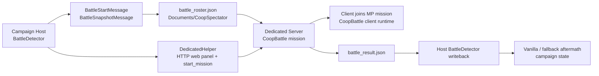

# Coop System Dependency Map

Date: 2026-03-28
Project: `BannerlordCoopSpectator3`
Scope: architecture cheat sheet for campaign -> dedicated -> MP mission -> aftermath writeback

## Purpose

This doc is a compact dependency map for future windows.
It is not a full design spec.
It exists to answer quickly:

- where battle startup data comes from
- how dedicated mission startup is controlled
- which runtime owns side/unit/spawn state
- how battle result flows back into campaign
- what currently works
- what the current blocker is

## High-Level Flow

## Ownership By Layer

### 1. Campaign Host

Primary owner:
- [BattleDetector.cs](C:/dev/projects/BannerlordCoopSpectator3/Campaign/BattleDetector.cs)

Responsibilities:
- detect campaign battle start
- build battle snapshot
- resolve campaign battle scene
- resolve multiplayer runtime scene candidate
- write `battle_roster.json`
- tell dedicated to start / end mission
- consume `battle_result`
- apply aftermath/writeback back into campaign

Important outputs:
- `BattleStartMessage`
- `BattleSnapshotMessage`
- `battle_roster.json`
- `battle_result` consumption

Current important facts:
- campaign battle scene extraction works
- scene resolver works
- prisoner transfer works
- loot/rewards/casualty/HP paths are already mostly working

### 2. Dedicated Helper / Startup Bridge

Primary owner:
- [DedicatedServerCommands.cs](C:/dev/projects/BannerlordCoopSpectator3/DedicatedHelper/DedicatedServerCommands.cs)

Responsibilities:
- query web panel options
- apply `GameType` / `Map`
- trigger `start_mission`
- trigger `end_mission`

Important dependency:
- web panel `GET /Manager/get_options`
- web panel `POST /Manager/set_options`
- `start_mission`

Current important facts:
- `stdin` commands were not enough
- real scene-aware switch now goes through `set_options`
- dedicated really can open `CoopBattle` on `mp_battle_map_001`

### 3. Dedicated Server Mission Bootstrap

Primary owners:
- [MissionMultiplayerCoopBattleMode.cs](C:/dev/projects/BannerlordCoopSpectator3/GameMode/MissionMultiplayerCoopBattleMode.cs)
- [MissionMultiplayerCoopBattle.cs](C:/dev/projects/BannerlordCoopSpectator3/GameMode/MissionMultiplayerCoopBattle.cs)
- [MissionMultiplayerCoopBattleClient.cs](C:/dev/projects/BannerlordCoopSpectator3/GameMode/MissionMultiplayerCoopBattleClient.cs)

Responsibilities:
- open mission
- build server/client mission behavior stacks
- expose mission type to engine
- drive phase ownership ticks

Important current detail:
- mission is still opened through:
  - `MissionState.OpenNew("MultiplayerTeamDeathmatch", ...)`
- but runtime mode is our custom `CoopBattle`
- on battle maps we now try to strip TDM-era behaviors aggressively

Why this matters:
- many crashes / waiting-screen problems are caused here
- battle maps are more sensitive than `mp_tdm_map_001`

### 4. Shared Mission Runtime

Primary owner:
- [CoopMissionBehaviors.cs](C:/dev/projects/BannerlordCoopSpectator3/Mission/CoopMissionBehaviors.cs)

Responsibilities:
- authoritative side/unit selection
- spawn intent / respawn contract
- materialization of campaign armies
- possession of materialized agents
- battle phase transitions
- battle completion
- battle result reconciliation

Important state machines inside:
- `CoopBattlePhaseRuntimeState`
- `CoopBattleSpawnIntentState`
- `CoopBattleSpawnRequestState`
- `CoopBattleSpawnRuntimeState`
- `CoopBattlePeerLifecycleRuntimeState`
- `BattleSnapshotRuntimeState`

Current important facts:
- side/unit selection and respawn loop already work on `mp_tdm_map_001`
- custom overlay is already working
- battle map runtime is still the unstable zone

### 5. Client Mission UI

Primary owners:
- [CoopMissionClientLogic](C:/dev/projects/BannerlordCoopSpectator3/Mission/CoopMissionBehaviors.cs)
- [CoopMissionSelectionView.cs](C:/dev/projects/BannerlordCoopSpectator3/UI/CoopMissionSelectionView.cs)
- [CoopSelection.xml](C:/dev/projects/BannerlordCoopSpectator3/Module/CoopSpectator/GUI/Prefabs/CoopSelection.xml)

Responsibilities:
- show custom side/unit/spawn overlay
- capture user selections
- issue spawn/reset/start-battle requests
- hide UI when player controls a unit
- restore UI on death / return to selection

Current important facts:
- vanilla TDM picker is suppressed
- custom overlay is stable
- cursor/focus/input issues were fixed
- on battle maps client currently gets stuck in waiting/intermission because mission startup chain is not fully synchronized yet

### 6. Battle Snapshot / Shared Data Carriers

Primary owners:
- [BattleStartMessage.cs](C:/dev/projects/BannerlordCoopSpectator3/Network/Messages/BattleStartMessage.cs)
- [BattleRosterFile.cs](C:/dev/projects/BannerlordCoopSpectator3/Campaign/BattleRosterFile.cs)
- [BattleSnapshotRuntimeState.cs](C:/dev/projects/BannerlordCoopSpectator3/Infrastructure/BattleSnapshotRuntimeState.cs)

Responsibilities:
- carry roster and battle metadata from campaign host to dedicated runtime
- provide runtime lookup for entries, sides, allowed troop ids, party modifiers

Critical scene-related fields:
- `MapScene`
- `WorldMapScene`
- `MapPatchSceneIndex`
- `MapPatchNormalizedX`
- `MapPatchNormalizedY`
- `MultiplayerScene`
- `MultiplayerGameType`
- `MultiplayerSceneResolverSource`

## Scene Transfer Chain

### Current Scene Logic

Campaign side:
- host extracts actual campaign battle scene, for example `battle_terrain_n`
- host resolves this into MP runtime candidate, currently for example `mp_battle_map_001`

Primary files:
- [BattleDetector.cs](C:/dev/projects/BannerlordCoopSpectator3/Campaign/BattleDetector.cs)
- [CampaignToMultiplayerSceneResolver.cs](C:/dev/projects/BannerlordCoopSpectator3/Infrastructure/CampaignToMultiplayerSceneResolver.cs)

Dedicated side:
- helper applies:
  - `GameType=CoopBattle`
  - `Map=mp_battle_map_001`
- mission then opens through `CoopBattle`

### Important Distinction

There are 3 different scene concepts:

1. `WorldMapScene`
- campaign world map wrapper
- not the combat scene

2. `BattleScene`
- vanilla singleplayer battle terrain
- for example `battle_terrain_n`

3. `MultiplayerScene`
- actual MP runtime scene
- for example `mp_battle_map_001`

Confusing these is a common source of bugs.

## Aftermath / Writeback Map

Primary owner:
- [BattleDetector.cs](C:/dev/projects/BannerlordCoopSpectator3/Campaign/BattleDetector.cs)

Already working or strongly validated:
- authoritative battle completion
- return from MP battle back to campaign
- win/lose outcome
- troop casualties writeback
- hero/companion wound and HP writeback
- item loot path
- regular prisoner transfer
- vanilla prisoner screen trigger
- rescued prisoners
- lord capture dialog path
- hero/party captivity path seems largely alive

Still weaker / not closed:
- exact XP fidelity from real combat events
- renown / influence
- relation / charm / honor aftermath fidelity
- large-army battle-map runtime stability

## Current Primary Blocker

Current blocker after latest tests:

`battle-map mission startup is stable enough not to crash immediately on scene switch, but client still remains on waiting/intermission screen unless the runtime chain fully survives early startup`

More exact current technical state:
- map switching to `mp_battle_map_001` works
- dedicated no longer crashes at the old scene-switch step
- battle-map runtime still crashes or stalls very early, around `AfterStart`, before normal mission ownership takes over
- latest mitigation now strips:
  - boundary placers
  - lobby component
  - poll/admin components
  - mission options
  - scoreboard
  - visual-spawn chain
for `mp_battle_map_*`

This means the next question is no longer:
- "can we switch map?"

It is now:
- "what is the minimal safe server/client mission stack that lets a client actually enter and run on an MP battle map?"

## Critical Files Cheat Sheet

### Campaign / startup
- [BattleDetector.cs](C:/dev/projects/BannerlordCoopSpectator3/Campaign/BattleDetector.cs)
- [BattleRosterFile.cs](C:/dev/projects/BannerlordCoopSpectator3/Campaign/BattleRosterFile.cs)
- [BattleStartMessage.cs](C:/dev/projects/BannerlordCoopSpectator3/Network/Messages/BattleStartMessage.cs)
- [CampaignToMultiplayerSceneResolver.cs](C:/dev/projects/BannerlordCoopSpectator3/Infrastructure/CampaignToMultiplayerSceneResolver.cs)
- [DedicatedServerCommands.cs](C:/dev/projects/BannerlordCoopSpectator3/DedicatedHelper/DedicatedServerCommands.cs)

### Dedicated / mission open
- [MissionMultiplayerCoopBattleMode.cs](C:/dev/projects/BannerlordCoopSpectator3/GameMode/MissionMultiplayerCoopBattleMode.cs)
- [MissionMultiplayerCoopBattle.cs](C:/dev/projects/BannerlordCoopSpectator3/GameMode/MissionMultiplayerCoopBattle.cs)
- [MissionMultiplayerCoopBattleClient.cs](C:/dev/projects/BannerlordCoopSpectator3/GameMode/MissionMultiplayerCoopBattleClient.cs)
- [MissionStateOpenNewPatches.cs](C:/dev/projects/BannerlordCoopSpectator3/Patches/MissionStateOpenNewPatches.cs)

### Mission runtime
- [CoopMissionBehaviors.cs](C:/dev/projects/BannerlordCoopSpectator3/Mission/CoopMissionBehaviors.cs)
- [BattleSnapshotRuntimeState.cs](C:/dev/projects/BannerlordCoopSpectator3/Infrastructure/BattleSnapshotRuntimeState.cs)
- [CoopBattleAuthorityState.cs](C:/dev/projects/BannerlordCoopSpectator3/Infrastructure/CoopBattleAuthorityState.cs)
- [CoopBattlePhaseRuntimeState.cs](C:/dev/projects/BannerlordCoopSpectator3/Infrastructure/CoopBattlePhaseRuntimeState.cs)

### Client UI
- [CoopMissionSelectionView.cs](C:/dev/projects/BannerlordCoopSpectator3/UI/CoopMissionSelectionView.cs)
- [CoopSelection.xml](C:/dev/projects/BannerlordCoopSpectator3/Module/CoopSpectator/GUI/Prefabs/CoopSelection.xml)

### Aftermath
- [BattleDetector.cs](C:/dev/projects/BannerlordCoopSpectator3/Campaign/BattleDetector.cs)
- [DedicatedKnockoutOutcomeModelOverride.cs](C:/dev/projects/BannerlordCoopSpectator3/DedicatedServer/Mission/DedicatedKnockoutOutcomeModelOverride.cs)

## Working Assumptions

These assumptions are currently safe enough for future work:

- `mp_tdm_map_001` is the stable baseline runtime
- `mp_battle_map_*` is the active migration target
- direct loading of singleplayer `battle_terrain_*` into MP is not the immediate next step
- prisoner system is no longer the main blocker
- battle-map startup and client entry are now the main blocker

## Recommended Use In Future Windows

When opening a new window, use this doc to answer first:

1. Which layer owns the bug?
2. Is the bug startup, mission runtime, UI, or writeback?
3. Is the relevant scene:
   - world map
   - campaign battle scene
   - MP runtime scene
4. Is the source of truth:
   - live `MapEvent`
   - `battle_roster.json`
   - `battle_result`
   - mission runtime state

This should save repeated rediscovery work.
